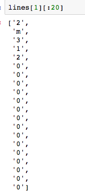
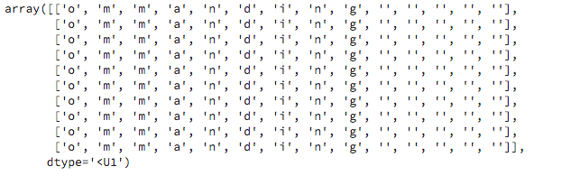
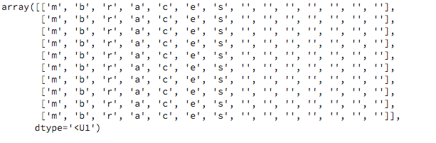
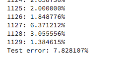
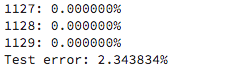
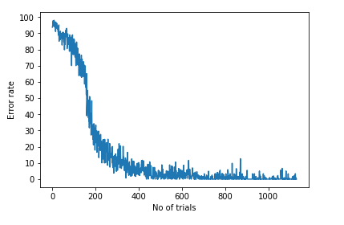

# Machine Learning Engineer Nanodegree
## Capstone Project
Mohammed Ayaz S

## I. Definition

### Project Overview

Optical Character Recognition is used to convert handwritten or printed text into Machine Encoded text. The aim of Optical Character Recognition (OCR) is to predict the handwritten text with maximum accuracy and minimal errors. Optical Recognition has a wide range of application.

Early Optical Character Recognition was mainly focused towards building tools to aid people who are blind. Since, then Optical Character Recognition has evolved to recognize sign boards for translation, navigation and for text-to-speech. OCR now has a wide range of applications from day-to-day applications to scientific applications.

Optical Character Recognition is a sub-domain of Image Recognition. In recent years, there is huge improvement in this area, thanks to low computation cost and improvement in GPUs.
The paper called ['Recursive Recurrent Nets with Attention Modeling for OCR in the Wild'](https://arxiv.org/pdf/1603.03101v1.pdf) gives an insight about what is being discussed here.  

The aim is here to build an OCR using Bidirectional Recurrent Neural Network and compare the accuracy with the Conventional Neural Network

### Problem Statement

Implement a model that recognizes a character set using Conventional RNN and also build the same model using Bidirectional Recurrent Neural Network then compare the accuracy of both models.

The objective here is to show that Bidirectional Recurrent Neural Network works better than RNN for OCR and there is an acceptable improvement in the accuracy.

### Metrics

The evaluation metric would be straightforward in the OCR. It is the accuracy of the prediction of the image text to the machine-encoded test. This would depend on various factors like size of the image and the quality of the image. There are labeled images and test images where the predicted label is compared with the labeled image for the accuracy.

**Error calculation**

- For every word calculate how many of the characters we predicted correctly
- Use the mask to not consider (leave out) the padded characters on which our prediction was wrong
- Find the fraction of each word where we made mistakes in our character prediction
- Find the average fraction of each word that were mistakes

## II. Analysis

### Data Exploration

**Dataset**

 The modified version of the MIT OCR dataset is downloaded from the ai.stanford.edu site. This file is called letter.data.gz. Further information on this dataset can be found on the site. This dataset contains a subset of the words in rasterized and normalized form. The original MIT dataset also contained the first letter of each word which was capitalized, and the rest were lowercase. This dataset has had the first character of every word removed so there are no words in capital letters. All words are in lowercase.

 There are roughly 52,000 character images, and these make up roughly 6800 words.One of the field values is the actual letter that is represented by the image. The Next ID points to the ID of the next letter of the word. The next ID is -1 when it indicates the start of a new word. We don't use the next three columns in this dataset, Word ID, Position, and then the Fold. We don't perform any cross-validation here, so this is not required. We do use the remaining 128 fields, which are the pixel values of the 16x8 images. Each array is 1 image of 128 elements, and these elements can be either 0 or 1. These images correspond to the characters which make up 

 The tab delimited data file (letter.data.gz) contains a line for each letter, with its label, pixel values, and several additional fields listed in letter.names file.

This is how our *dataset* looks like - 

| id        | letter           |  next_id| word_id| position|  fold |  p_0_0|  p_0_1|  .....|  p_15_7|
| ------------- |:-------------:| :------:| :-----:| :------:| :----:| :----:| :----:| :----:| :-----:| 
| 1             | o             | 2       | 1      | 1       | 0     | 0     |  0    | 0     |  0     |
| 2             | m             | 3       | 1     |  2      | 0     | 0     |  0    |  0    |  0     |  

*Fields*
1. id: each letter is assigned a unique integer id
2. letter: a-z
3. next_id: id for next letter in the word, -1 if last letter
4. word_id: each word is assigned a unique integer id (not used)
5. position: position of letter in the word (not used)
6. fold: 0-9 -- cross-validation fold
7. p_i_j: 0/1 -- value of pixel in row i, column j

Screenshot of the first few lines of our dataset- (first 20 columns).

### Exploratory Visualization

The total number of words in our dataset - (6877, 6877)

**Tensor shape**
- 6877 words
- Each word padded to have 14 characters
- Each character represented by a 16x8 image

Padded Data shape
(6877, 14, -1)

### Algorithms and Techniques (Including Architecture)

**Neural Network** -  one group of algorithms used for machine learning that models the data using graphs of Artificial Neurons, those neurons are a mathematical model that “mimics approximately how a neuron in the brain works”.

 **Recurrent neural network** (RNN) is a class of artificial neural network where connections between units form a directed graph along a sequence. Recurrent Neural Networks (RNNs) are popular models that have shown great promise in many NLP tasks, but in this project - it is used to recognize hand-written character text.

**Representation of RNN** - [source](https://medium.com/@erikhallstrm/hello-world-rnn-83cd7105b767)

**Bidirectional recurrent neural networks**(RNN) are just putting two independent RNNs together. The input sequence is fed in normal time order for one network, and in reverse time order for another. The outputs of the two networks are usually concatenated at each time step, though there are other options, e.g. summation.

**Representation of  Bidirectional RNN** - [source](http://colah.github.io/posts/2015-09-NN-Types-FP/)

There is no specific algorithm used here. The data is download and reshaped for accordingly. The target features are recognized and data is trained.

In addition this - we are also building a Recurrent Neural Network.  Every layer in our RNN will have 300 neurons. This is a hyperparameter. The change in the number of neurons according to how the result changes. The long memory cell is used so that we get better performance. The GRU cell is used.

We'll then improve the results that we get with a conventional RNN architecture by using a bidirectional RNN. We have an additional layer called the backward RNN to which we also feed in our image inputs.

the forward RNN, built using the conventional RNN architecture that we've so far, 14 RNN layers of 300 neurons each. The bidirectional RNN though has an additional RNN layer, which is the backward RNN. This once again has 14 RNN layers of 300 neurons each, but it accepts the input in reverse.

 The outputs of the forward and the backward RNN that we receive are then combined together. This simply stacks the outputs together. This concatenated output is then passed on to the shared softmax for prediction. And this insertion of a backward RNN makes our bidirectional RNN architecture.

### Benchmark

There are various present models and parameters to benchmark with. Here, two models (RNNs and Bi-directional RNNs) are benchmarked with each other test.
The accuracy is compared.

## III. Methodology

### Data Preprocessing

All words lengths should be the same
- Get every word to be the same length as the longest word in our dataset
- Pad the words with empty characters

**Tensor shape**
- 6877 words
- Each word padded to have 14 characters
- Each character represented by 16x8 image

**Reshape the data so the image is a 1-D array of pixels**

**Tensor shape**
- 6877 words
- Each an array with 14 characters (padded with empty strings as needed)
**One-hot representation**
- Each character has a feature vector of 26 (only lower case characters)
 `padded_target.shape + (26,)`
 **(6877, 14, 26)**

### Implementation

- Download the modified version of the MIT OCR dataset from the ai.stanford.edu site. the file is letter.data.gz file.
- We set up a helper function to download this gzipped file from the URL.
- We set up another helper function to read the lines in the file. We use the gzip.open function from the gzip library. Use the CSV library to read in the file with tab delimited fields. Create a list of lines. There are roughly 52,000 character images, and these make up roughly 6800 words.
- One of the field values is the actual letter that is represented by the image. The Next ID points to the ID of the next letter of the word. The next ID is -1 when it indicates the start of a new word. We don't use the next three columns in this dataset, Word ID, Position, and then the Fold.
There are no cross-validation performed here.
- We do use the remaining 128 fields, which are the pixel values of the 16x8 images. Each array is 1 image of 128 elements, and these elements can be either 0 or 1. -
- These images correspond to the characters which make up words. Back to our code, we've just read in our data in the form of lines, and here we can sample the values present in a single line. These values should correspond to the file format that we just studied.

**Features and Labels**

- The input to our recurrent neural network, that is the features, are a sequence of character images where every image is 16x8 pixels.
- We set up a helper function to get the features and labels from the lines of data that we just read in.
- The data that we just read in has a unique sequential integer ID assigned to every line, so we sort on this character ID. Character sequences which make up words are maintained.
- Set up lists for the data and the target values. The data is the input sequence of images which make up words, and the target is the word as a sequence of actual characters, not images.
- Initialize next_id to -1. Remember that -1 indicates the start of a new word. The word and word_pixels variables keep track of the current word. Word comprises of characters which make up a word, and word_pixels are the images of those same characters.
- We'll iterate through all the lines to get the information that we need. The next_id is the field at index 2 in every line. Access the fields which hold the pixel values in the form of an array. These are fields which range from position 6 to position 134. Since these pixel values make up a 2D image matrix, reshape the array to be a 16x8 image.
- We have the image for a single character, and the character itself we appended to word_pixels and word. If the next_id field of the current line is equal to minus 1, that means we've completed passing 1 word.
- We can move onto the next word, and we append the current word to the data and target lists. Go ahead and reset word and word_pixels because we've moved onto the next word.
- We already have all the information that we require on the current word. Return the data and target. These are the features and labels from our training dataset. The length of the data list and the target list should be exactly the same, equal to 6877, the number of words in our training data. At this point, all our word sequences are of different lengths

**Shuffle and Feed in Training Data**

 - Our training data is setup. Training data should always be fed into our machine learning model in shuffled form so that there are no unwanted patterns that our model picks up in our input.
 - Shuffle indices using np.random.permutation and then set up shuffle features and corresponding labels. We'll now split this dataset into training and test data.
 - The training data will be used to generate our machine learning model parameters, and the test data will be used to measure how well our model performs on a dataset that it hasn't seen before. Sixty-six percent of our data will be used for training, and the remaining for test data.
 - Split the data, as well as the labels into training and test portions. Let's take a look at the shape of the training data, which is the input to our RNN. There are 4538 words in our training dataset.
 - The input tensor that we feed into our recurrent neural network for training is of this form. This is a three-dimensional tensor which can be represented as you see on screen. The first dimension is the batch size. Neural networks are typically trained by feeding in our input data in batches so we don't run out of memory.
 - The batch_size corresponds to the number of words that we want to feed in in a single batch. The second dimension represents the length of every word. This is the sequence length of our RNN.

**Sequence Length Calculations**

- RNNs require that the sequence length of the data that we feed into the neural network be exactly the same. However, we want to keep track of the exact sequence length of all the words that we feed in as our training data. We store the sequence length of every word that we feed in as a batch in the sequence_length variable, and we get the sequence length using these complicated computations that you see on-screen. Having the sequence length helps us in two specific ways.
- This is the exact word length for each word in our batch. We'll pass the sequence length as a parameter when we build our RNN, and it'll help improve the RNN's accuracy because the RNN will now know the exact sequence length that it needs to get right. It won't worry about the padding characters.  
- There are 14 input images for each word, but some of these input images will be all 0s, which represent the padding characters. The first line in the sequence length calculation checks to see whether the image contains any non-0 element. If it does, then it's an actual character. If it contains all 0s, it's a padding character.  
- If this maximum value is 1, that's an actual character. If it's 0, it's a padding character. The tensor stored and used will contain a list of 14 elements for each word. The elements will be 1 for those characters which are actual non-padding characters and will be 0 for padding characters.
- the word cat, you'll get a length of 3. Cast this value to an integer and that is your sequence length.

**Building the RNN**

- Every layer in our RNN will have 300 neurons. This is a hyperparameter. You can change the number of neurons and see how your result changes.
- a long memory cell is used so that we get better performance. We'll use the GRU cell.
-  The input argument that you need to pass in includes the memory cell that it has to unroll through time. The dynamic RNN will automatically unroll the cell based on the number of steps that we've specified.
- The second input argument that you see here highlighted on-screen is our X placeholder for our training data. The sequence length is an optional parameter that we've chosen to specify here.
- The sequence length helps in improving the correctness of our RNN and not its performance. If the RNN knows what characters are valid and what characters are padding characters in every input word, it'll know that it can copy through state and zero out outputs when it's working on the padding characters. It'll perform actual prediction for the real characters.
- The result of the RNN is a tuple, which specifies the predicted output and the last internal state of the RNN. The last internal state is not needed here.

**Training and Evaluating the RNN**

 - Calculate the accuracy of our neural network in optical character recognition.
 - Every word is made up of 14 characters, either real characters or padded ones, and there'll be 14 predictions, 1 for each character of the word.  
 - we're only interested in the predictions for the actual characters, and we can completely ignore the padded character predictions and not include them in our count of errors.
 - To calculate the accuracy of our RNN output, compare the actual and the predicted labels for the actual characters.
 - Ignore the padding that we've applied to every word by masking out the padded characters. Here is where the sequence length that we calculated earlier will prove useful.
 - Choose the character with the highest probability value as our prediction. The labels that we fed in during training were also one-hot encoded. They didn't have probability values though. They had the value 1 for the character represented.
 - Calculate the number of characters that were not predicted correctly for every word. These are the mistakes that our RNN made in optical character recognition.
 - Determine the index of the predicted character, as well as the actual character. If the index of the predicted character matches the index of the actual character, the prediction was correct; otherwise it was wrong.

 **Setup the Bidirectional RNN**

 - Construct the bidirectional RNN by using two conventional RNNs. The data to the backward RNN will be fed in reverse. Here is the architecture of the conventional RNN that we set up earlier. Every layer of our RNN shares a softmax layer for prediction.
 - This RNN contains 14 layers, because that is the length of every word of 300 neurons each.
  - Construct a bidirectional RNN by adding a backward RNN to the forward RNN which already exists. The forward RNN will be 14 layers of 300 neurons each. The backward RNN will also have 14 layers of 300 neurons each.
  - The input to this RNN will be fed in reverse. This will allow this RNN to make predictions based on future state. We'll take the output of the forward, as well as the backward RNN and concatenate them together and then feed this concatenated output to our softmax layer.
  -  We extract the features and labels from the data as before. Pad all the words to be the same length. That is 14.
  -  Set up the placeholders for the training data and the corresponding labels as before.

Finally, acurracy is compared.

### Refinement

The refinement made is just tuning hyperparameters that are adjusting the no of neurons i.e. 300. There is a lot of trial and error involved.

The decrease in the no of neurons tooks very little time to training but there was a drop in the accuracy i.e it gave us the accuracy of around 67%

When the no of neurons were increased, it took longer to train and accuracy was increased to 92% in case of RNNs and 97% in case of Bidirectional RNNs. 

Another refinement that is done is building a Bidirectional RNN which reduces the test error rate by 81% approximately that will be discussed in the results section.

## IV. Results

### Model Evaluation and Validation

The final model is aligned the with solution expected i.e. there is an improvement in the accuracy of Optical Character Recognition.
The bidirectional RNN that takes in reverse output an input which is time specific. It drastically increases the accuracy.
The dataset used here is MIT OCR dataset and model is evaluated by using split and shuffle technique of the dataset. Sixty-six percent of the data is used for training and rest is used for testing.
The model is robust enough to take any dataset with the only condition of being the similar dimension to that MIT OCR dataset

There are methods in the project that can handle the preprocessing like padding, setting the datasets in the right dimension. It means that it can handle datasets with some pre-processing. It is robust as we are using shuffle and split method for training the model which ensures that there is no overfitting and also ensures that model is learning at a great rate. 

### Justification

The two models were built i.e One using Conventional RNNs and other one using Bidirectional RNNs. Both models use the same dataset i.e. MIT OCR dataset with a slight modification.
We made an assumption that Bidirectional RNNs would increase the accuracy by decreasing the test accuracy. It is observed that there is a significant increase in the accuracy i.e. 81% after using bidirectional RNNs

Test error of the Conventional RNNs -: 7.828107%
Test error of Bidirectional RNNs -: 2.343834%

So that sums up to the accuracy of 91.2% in case of Conventional RNNs and 97.66% in case of Bidirectional RNNs

**Accuracy of Conventional RNNs**

**Accuracy of Bi-directional RNNs**

**Graph plot**

Conventional RNNs:

Bidirectional RNNs

## V. Conclusion

We have built a model that implements Optical Character Recognition using both RNNs and Bidirectional RNNs. We have observed that there is a significant increase in accuracy when you use Bidirectional Recurrent Neural Network, which is in line with our assumption that we had made earlier. There are other OCR implementations that can be used to implement this project. For now, we have used Bidirectional RNNs which has an accuracy of 97.66% approximately as compared to the accuracy of 92% in case of Conventional Neural Network.

The most interesting part of this project is the domain itself. It makes me ponder that level of improvement that is made in this field. We have designed programs to recognize images. In the next ten years, improvement in OCR could change the face of this world. 
The biggest challenge that I came across was creating a RNNs and Bidirectional RNNs and getting the right accuracy. One thing that I learnt from this process is creating systems that are complex enough to get the job done and eliminating the need for high end hardware. 

###Improvements

The model built does have some limitations. It could be improved in many ways. One way could be recognizing words 'Cat' instead of only 'cat'. The dataset contains only words that are not capitalized. The model could be improved to recognize the images that are blurred out to some extent but this would lead to drop in the accuracy to some extent. Accuracy factor can also be improved by training the model longer i.e. using more images. In the end, there is always room for improvement.

-----------
## References

**Dataset**: http://ai.stanford.edu/~btaskar/ocr/

https://towardsdatascience.com/understanding-bidirectional-rnn-in-pytorch-5bd25a5dd66

https://medium.com/@erikhallstrm/hello-world-rnn-83cd7105b767

Recursive Recurrent Nets with Attention Modeling for OCR in the Wild - https://arxiv.org/pdf/1603.03101v1.pdf
